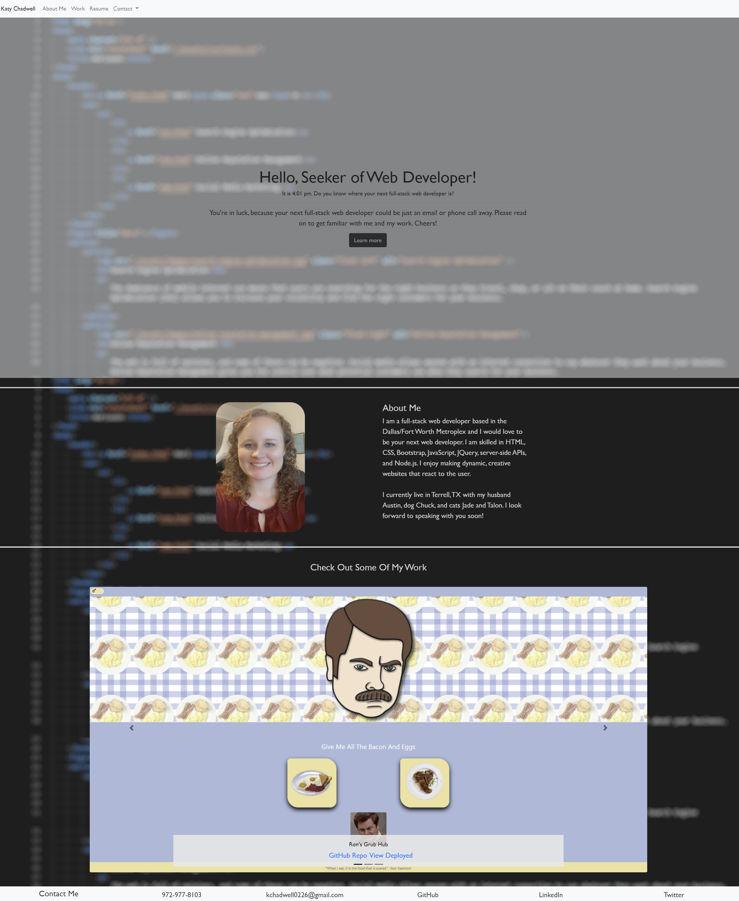

# Katy Chadwell Portfolio

This is my professional portfolio repository.

When the user visits my page, they will see a navbar at the top that contains my name, links to the About Me and Work sections of the page. Clicking them will jump to those sections. The navbar also contains a link to my downloadable resume. There is also a dropdown menu that contains my phone number, email address, and links to my GitHub, LinkedIn, and Twitter.  The user is then greeted by a jumbotron containing a welcome message that includes the current time updated every 60 seconds as well as a button called "Learn More." Upon clicking that button or scrolling down, the user will see a photo of me as well as a brief biography and skills.

The user may continue to scroll and will see a carousel of my recent works. The recent works are *Ron's Grub Hub*, *Weather Dashboard*, and *Work Day Scheduler*. The carousel will cycle through these projects unless the user is hovering on the carousel, then it will pause. The user may also cycle through manually by clicking the next or previous arrows. On each carousel image, there is the name of the project, as well as a link to my GitHub repo and deployed application for each project.

At the bottom of the page, there is a footer that contains my phone numnber, email address, and links to my GitHub, LinkedIn, and Twitter.

Please follow [this link](https://klay824.github.io/katy-chadwell-portfolio/) to view the live application.

## Technology Used
* HTML
* CSS
* Bootstrap 4
* JavaScript
* Jquery
* Moment.js

## Resources
* [moment.js Documentation](https://momentjs.com/)
* [Bootstrap 4 Documentation](https://getbootstrap.com/docs/4.6/getting-started/introduction/)

## Video Demonstration

## Screenshot

