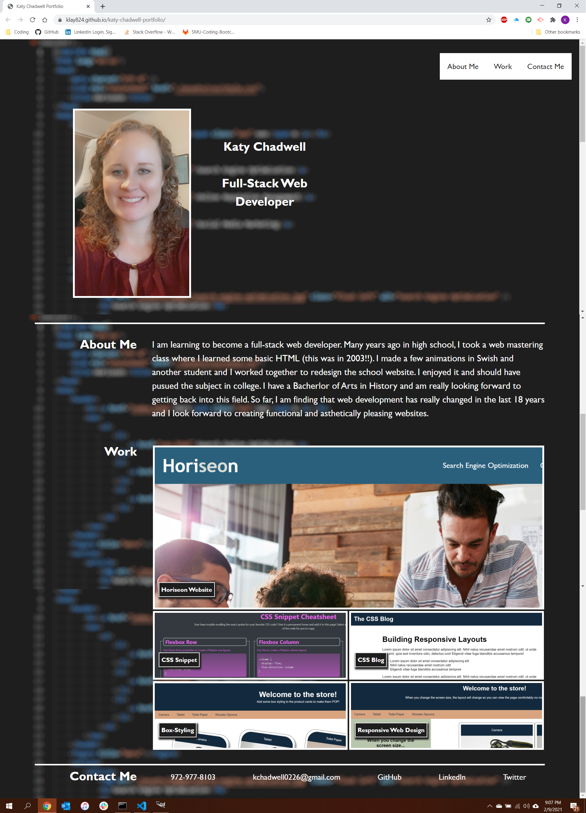

<strong>Katy Chadwell Portfolio</strong>

This is my professional portfolio repository.

I have created an html file that contains the markup for the page. I created a variables.css file to store color variables. I have also created a css file that adds styling though a background image, a flexbox for a navbar, ID section, work, resume, and contact section. The resume links to a placeholder at this time. It will eventually hold my actual resume. Each flexbox resizes for device responsiveness. The links in the navbar scrolls to the corresponding section of the page when clicked. I added an image and link to the first week's homework as my main project, and photos and links for four in-class activities as fillers until I make more of my own projects throughout this class.  In the contact section, I have provided links for my phone number, email, GitHub, LinkedIn, and Twitter. 

<a href="https://klay824.github.io/katy-chadwell-portfolio/">My deployed application.</a>

<strong>Deployed Portfolio Screenshot</strong>

