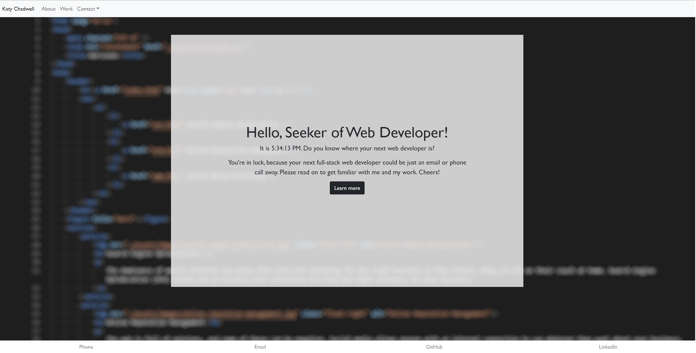
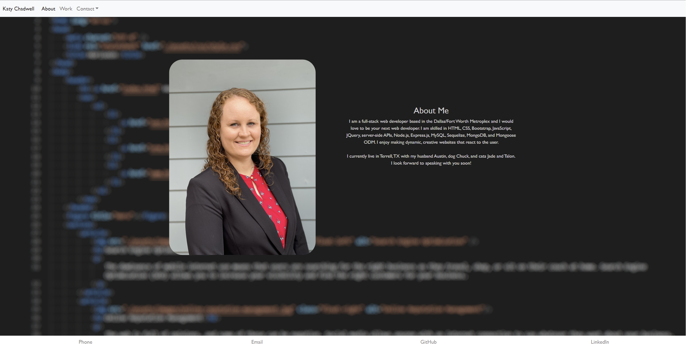
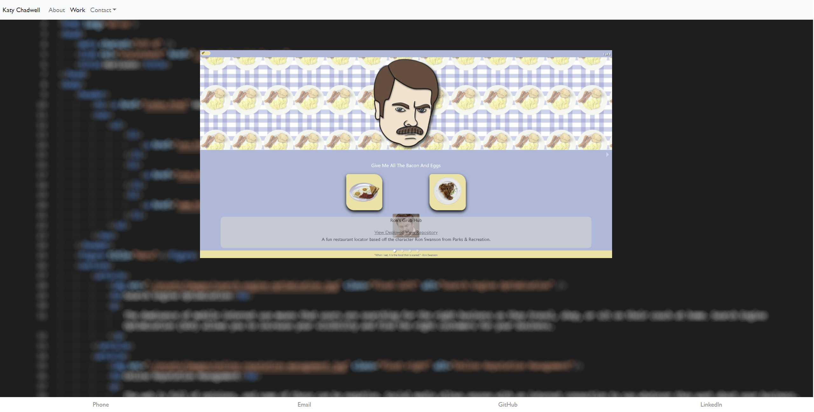

# Katy Chadwell Portfolio

This is my professional portfolio repository.

When the user visits my page, they will see a navbar at the top that contains my name, links to the About Me and Work sections of the page. Clicking them will route to those pages. The navbar also contains a link to my downloadable resume. There is also a dropdown menu that contains my phone number, email address, and links to my GitHub, LinkedIn, and Twitter. The user is then greeted by a jumbotron containing a welcome message that includes the current time as well as a button called "Learn More."

Upon clicking that button or of clicking _About_ in the Navbar will take the user to my About page that includes a photo as well as a brief biography. Clicking _Work_ in the Navbar will take the user to the Works page where they will find a carousel of some of my works. Each slide contains a photo, as well as links to the deployment and repository, and a brief description.

Finally, at the bottom of the page the user will find the footer which contains links to my phone number, email, GitHub and LinkedIn.

Please follow [this link](https://klay824.github.io/katy-chadwell-portfolio/) to view the live application.

## Technology Used

- React.js
- React Bootstrap
- React-Responsive-Carousel
- HashRouter
- Bootstrap
- CSS

## Resources

- [React.js Documentation](https://reactjs.org/)
- [React-Bootstrap Documentation](https://react-bootstrap.github.io/)
- [React-Responsive-Carousel Documentation](http://react-responsive-carousel.js.org/)
- [How to Map a Carousel](https://stackoverflow.com/questions/67185790/how-to-pass-react-bootstrap-carousel-items-to-a-map-function)
- [Keep That Damn Footer at the Bottom](https://medium.com/@zerox/keep-that-damn-footer-at-the-bottom-c7a921cb9551)
- [Displaying An Updating Time in React](https://medium.com/create-a-clocking-in-system-on-react/create-a-react-app-displaying-the-current-date-and-time-using-hooks-21d946971556)

## Screenshots

